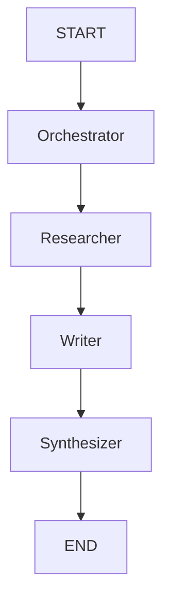

# AI-Powered Report Generator using LangChain, LangGraph & Groq

This project demonstrates a **fully automated research report generator** powered by **LLMs**, using **Groq’s LLama 3**, structured orchestration with **LangGraph**, and real-time search via **Tavily**. It can dynamically plan, research, write, and synthesize a complete markdown-based report on any given topic.

---

## Overview

---

This project generates a structured, high-quality report on a given topic using the following AI agent pipeline:

1. Planner – Breaks down the main topic into subtopics.
2. Researcher – Conducts research on each subtopic using Tavily (or Bing-like search).
3. Writer – Writes sections of the report using the research data.
4. Synthesizer – Combines the sections into a final Markdown report.

This flow is implemented using a directed LangGraph with edge conditions and state management.

--- 

##  Features

-   **Automated Planning:** Autonomously plans the main and sub-sections of the report based on the given topic.

-   **Real-Time Web Research:** Uses the Tavily search engine to gather the most current and relevant information for each section.

-   **Intelligent Content Generation:** Produces natural and informative text based on the research findings, mimicking human-like writing.

-   **Modular Architecture:** Thanks to LangGraph, each step (planning, research, writing) is designed as a separate node, making the system flexible and extensible.

-   **Markdown Output:** The final report is delivered as a standard Markdown file, which is easy to read and convert to other formats.

---

## Tech Stack

| Tool/Library     | Purpose |
|------------------|---------|
| **[Groq](https://groq.com/)**           | Ultra-fast LLaMA 3 inference backend |
| **[LangChain](https://www.langchain.com/)**     | LLM abstraction, tool and prompt management |
| **[LangGraph](https://github.com/langchain-ai/langgraph)**     | State machine to model dynamic agent workflows |
| **[Tavily API](https://docs.tavily.com/)**      | Real-time web search |
| **Pydantic**      | Input/output validation |
| **Python 3.10+** | Language and typing support |

--- 

##  How It Works

1. **Topic Input:** You provide a report topic.

2. **Planner (Orchestrator):** The LLM breaks the topic into sections.

3. **Researcher Node:** Each section is researched via Tavily Search.

4. **Writer Node:** The LLM writes each section using the research context.

5. **Synthesizer Node:** All sections are combined into one final markdown report.

---

## Architecture



Each node is defined as a LangGraph function node and passes state between each step.


---

## Installation & Setup

To get a local copy up and running, follow these simple steps.

**1. Clone the Repository:**

```bash
git clone https://github.com/berkyalkn/langgraph-report-generator.git
cd langgraph-report-generator
```

**2. Create and Activate a Virtual Environment:**

```bash
# Windows
python -m venv venv
.\venv\Scripts\activate

# macOS / Linux
python3 -m venv venv
source venv/bin/activate
```

**3. Install Dependencies:**
Run the following command in the project's root directory. This assumes you have already created a `requirements.txt` file.
```bash
pip install -r requirements.txt
```
> **Note:** If you don't have a `requirements.txt` file yet, you can create one with the command `pip freeze > requirements.txt`.

**4. Set Up API Keys:**
The project requires API keys for the Groq and Tavily services.

-  Create a .env file in the root folder with your API keys:
    
-   Open the `.env` file and enter your own API keys:
    ```
    GROQ_API_KEY=your_groq_api_key

    TAVILY_API_KEY=your_tavily_api_key
    ```
---

## Run the Project

Update the topic in the last cell of the script (or pass dynamically), and run the script:

```python
topic = "The career of LeBron James and his impact on the NBA"
```
