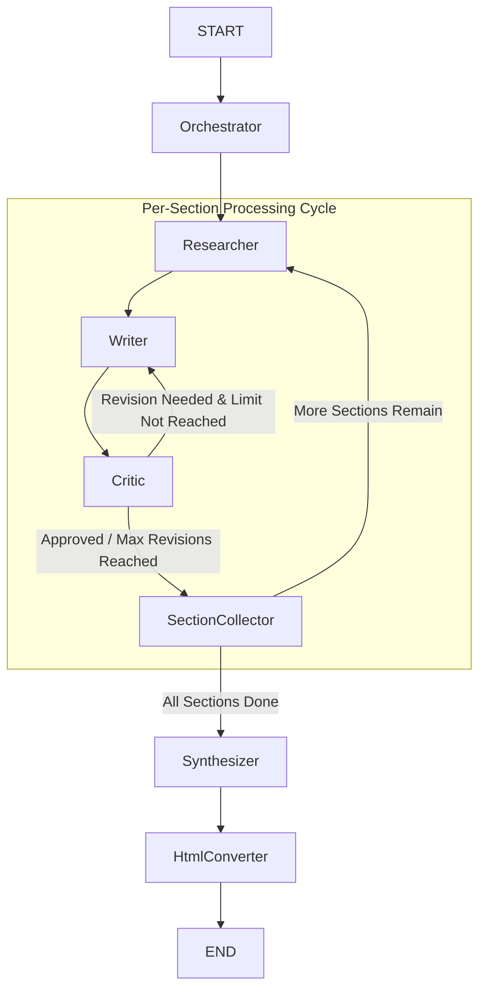

# AI-Powered Report Generator using LangChain, LangGraph & Groq

This project demonstrates a fully automated research report generator powered by LLMs, using Groq’s Llama 3, structured orchestration with LangGraph, and real-time search via Tavily. It can dynamically plan, research, write, critique, and synthesize a complete report, delivering it as both **Markdown and a styled HTML file**.

---

## Overview

---

This project generates a structured, high-quality report using a sophisticated AI agent pipeline built with LangGraph:

1.  **Planner (Orchestrator)** – Breaks down the main topic into a structured outline with multiple sub-sections.
2.  **Per-Section Execution Loop** – The graph then processes each section of the outline one by one.
    -   **Researcher** – Conducts real-time web research on the current sub-topic.
    -   **Writer** – Writes a draft of the section using the gathered research data.
    -   **Critic** – Reviews the draft for quality, accuracy, and depth. It decides if a revision is necessary.
3.  **Self-Correction Cycle** – If the Critic agent requests a revision, the draft is sent back to the Writer with constructive feedback. This loop continues until the section meets quality standards or a maximum revision limit is reached.
4.  **Synthesizer** – Once all sections are approved, they are compiled into the final Markdown report.
5. **HTML Conversion:** The final Markdown report is converted into a beautifully styled HTML file with embedded CSS, ready for viewing in any web browser.


This advanced flow, featuring conditional edges and cycles, showcases a more robust and autonomous agentic system.

--- 

##  Features

-   **Automated Planning:** Autonomously plans the main and sub-sections of the report based on the given topic.

-   **Real-Time Web Research:** Uses the Tavily search engine to gather the most current and relevant information for each section.

-   **Intelligent Content Generation:** Produces natural and informative text based on the research findings.

-   **Self-Correction & Critique Cycle:** A built-in Critic agent reviews each section and provides feedback, forcing the Writer agent to revise its work until it meets quality standards. This is a true reflection loop.

-   **Resilient Looping:** Includes a maximum revision limit to prevent infinite loops and ensure process completion, making the agent more robust.

-   **Modular Architecture:** Each step (planning, research, writing, critique) is a separate node in LangGraph, making the system flexible and extensible.

-   **Markdown Output:** The final report is delivered as a standard Markdown file.

-  **Styled HTML Output:** The final report is also automatically converted into a clean, modern, and readable HTML file for professional presentation.

---

## Tech Stack

| Tool/Library     | Purpose |
|------------------|---------|
| **[Groq](https://groq.com/)**           | Ultra-fast LLaMA 3 inference backend |
| **[LangChain](https://www.langchain.com/)**     | LLM abstraction, tool and prompt management |
| **[LangGraph](https://github.com/langchain-ai/langgraph)**     | State machine to model dynamic agent workflows with cycles |
| **[Tavily API](https://docs.tavily.com/)**      | Real-time web search |
| **Pydantic**      | Input/output validation and data structuring|
| **Python 3.10+** | Language and typing support |
| **markdown2** | Markdown to HTML conversion|

--- 


## How It Works

The system operates as a sophisticated, multi-step agentic workflow that processes a topic from planning to final synthesis, incorporating a self-correction loop for quality assurance.

1.  **Topic Input & Planning:** The process begins with a user-provided topic. The Orchestrator agent then creates a structured outline by breaking the topic into logical sub-sections.

2. **Per-Section Processing Loop:** The graph enters a main loop to handle each section individually. For every section in the outline, the following sub-process is executed:

+ **Research:** The Researcher agent performs a real-time web search via Tavily Search to gather current and relevant information for the specific section.

+ **Write:** The Writer agent uses the research findings to compose a draft of the section.

+ **Critique:** The Critic agent evaluates the draft for quality, accuracy, and depth. It then decides whether the section is approved or requires revision.

3. **Self-Correction Cycle (Revision Loop):** If the Critic requests a revision, the draft is sent back to the Writer along with constructive feedback. This inner loop continues until the section is approved or a pre-defined maximum revision limit is reached, preventing infinite cycles.

4. **Synthesis:** Once all sections have been individually written and approved through the critique cycle, the Synthesizer node compiles them into the final, coherent report in Markdown format.

5. **HTML Conversion:** The final Markdown report is converted into a beautifully styled HTML file with embedded CSS, ready for viewing in any web browser.
---

## Architecture



Each node is defined as a LangGraph function node and passes state between each step.


---

## Installation & Setup

To get a local copy up and running, follow these simple steps.

**1. Clone the Repository:**

```bash
git clone https://github.com/berkyalkn/langgraph-report-generator.git
cd langgraph-report-generator
```

**2. Create and Activate a Virtual Environment:**

```bash
# Windows
python -m venv venv
.\venv\Scripts\activate

# macOS / Linux
python3 -m venv venv
source venv/bin/activate
```

**3. Install Dependencies:**
Run the following command in the project's root directory. This assumes you have already created a `requirements.txt` file.
```bash
pip install -r requirements.txt
```
> **Note:** If you don't have a `requirements.txt` file yet, you can create one with the command `pip freeze > requirements.txt`.

**4. Set Up API Keys:**
The project requires API keys for the Groq and Tavily services.

-  Create a .env file in the root folder with your API keys:
    
-   Open the `.env` file and enter your own API keys:
    ```
    GROQ_API_KEY=your_groq_api_key

    TAVILY_API_KEY=your_tavily_api_key
    ```
---

## Run the Project

Update the topic in the last cell of the script (or pass dynamically), and run the script:

```python
topic = "The career of Stephen Curry and his impact on the NBA"
initial_state = {
    "topic": topic,
    "current_section_index": 0,
    "completed_sections": []
}
final_state = app.invoke(initial_state)

```

After running the script, you will find `report.html` in your project directory.
